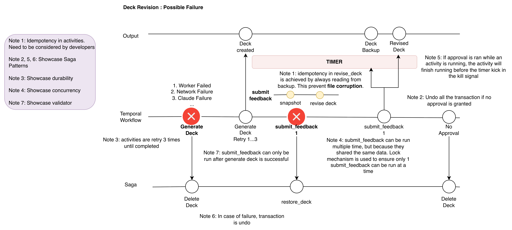

## Getting started
This repository shows how hard it is to generate a deck and iterate on it with human feedback durably. It sounds like a simple exercise — until you run it in a distributed environment where the worker can crash, the model can fail mid-edit, and the human can take days to respond.

> Note: This may be an overly simplified example, but in a production setting e.g. transfer fund, make travel booking, these considereations may be worth considering.

**4 Areas to be covered:**
Interaction    — signal vs update vs query; validators; handler concurrency
Detection      — timeouts; heartbeats; retryable vs terminal errors
Recovery       — idempotency; saga/compensation; durability/replay
Foundation     — determinism & sandbox; workflow ID reuse; schema evolution




```sh
# Activate environment
python3.13 -m venv .venv
source .venv/bin/activate 

# Installation
pip install -r requirements.txt 

# Getting Started
temporal server start-dev
python worker.py

cd agents
python app.py
# app.py prints a unique Workflow ID (deck-workflow-<8 hex chars>) — pass it to the commands below
python feedback.py deck-workflow-96853fe5 --feedback "Add a new slide at first slide called 2 you and a picture of a flower"
python feedback.py deck-workflow-ab2ca2ba --approve
temporal workflow query --workflow-id deck-workflow-96382778 --type revision_status # show lock
```

### Other useful CLI command
```sh
# Show temporal workflow (use the ID printed by app.py)
export workflowname="deck-workflow-a1b2c3d4"
temporal workflow show --workflow-id $workflowname --detailed
```

## Tech Stack
- Claude Agent SDK : Use this instead of client sdk due to cost reason. You will need a claude code subscription to run this project
- Temporal: Will display (1) Durability, (2) Visibility, (3)Atomicity in activities Orchestration, (4) Faciliate Saga Pattern
- Code: Idempotency, Saga Pattern

## Use Case
**Happy Path**
1. Approve before Gen Deck Completed: Passed, Outcome: Deck Generated and Saved
2. Feedback cannot be started before Gen Deck is ready, Passed, Outcome: Error message 
3. Approve while Revise Deck is running, 
4. Approve while Gen Deck is running, 
**Saga**
2. Timeout (Gen Deck > Revise Deck > Timeout): Passed, outcome: All files deleted (Saga kicked in)
4. Gen Deck > Completed > Revise Deck > Logout from Claude: Failed > restore deck: Passed, Outcome: Restore Deck worked (Saga Kicked in)
**Test Durability**
3. Gen Deck > shut down worker > complete Gen Deck > Revise Deck: Passed, Outcome: Worker Resumed and activity continued
**Concurrency**
5. Gen Deck > Completed > Send Feedback A and Feedback B at the same time > B waits on lock > A applied > B applied, Passed, Outcome: Revisions serialized by asyncio.Lock, revision_status query shows locked=true while A runs, 
**Idempotency**
6. Gen Deck > Completed > Revise Deck > kill worker after Claude has partially edited the deck > restart worker > retry attempt 2: Outcome: Deck reset from snapshot before retry, feedback applied exactly once (no duplicated edits)

